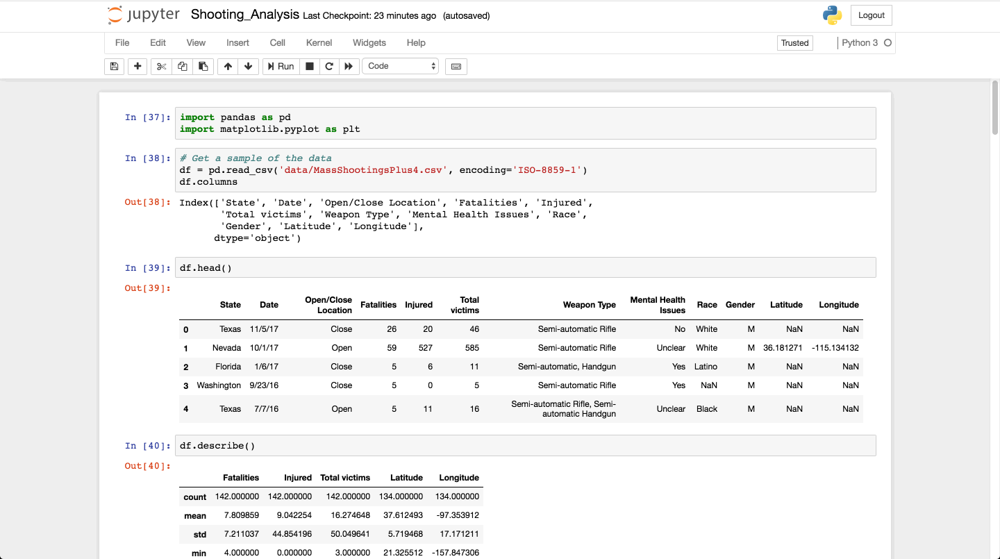

[](https://mybinder.org/v2/gh/AlexGoico/Torres-Code-Review/master)

Torres Code Review
==================

Just a simple code review I did with JD over a mass shooting dataset

Usage
=====
Create a virtualenv in the project
```
pip install virtualenv # if not already installed on your system

mkdir .env
cd .env
virtualenv .
cd ..
source .env/bin/activate
pip install -r requirements.txt
```

Run the Jupyter Notebook
```
jupyter notebook
```

Run all cells

